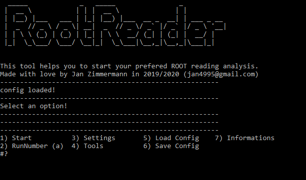

# RootReader

This helps you to read in WaveCatcher binary files and convert them to .root files.

Only use within a ROOT environment.
Start with:
> ./RunHelper.sh

##Calibration & Baseline
There are 3 text files inside the src folder. They contain some preset data. The script will use this data if the Run Name of the input binary folder matches the name in the text file.
Example: The binary files are in a folder called: "1_testRun". The script will now search in the txt files for something like:
> 1_testRun = {dummy_value,dummy_value,...};
and loads this as charge/amplitude calibration vector and baseline inside the script. If there is no matching line in the txt file, the script will use dummy values.

##Headersizes & WC versions
If the binary files are written with a specific WaveCatcher version, the header of these binary files may also vary. A wrong header size almost always ends up in a segmentation fault.
The script offers an automatic headersize detection mode (set headersize on "a" -> default), which checks the header for every binary file. 
Using this feature, its also possible to read in different binary files from different WaveCatcher versions automatically.

##Config
Its possible to save and load a small config, which is just a text file. This helps if you are working with different settings and want to save some time :)

For instant help just open menu item #12 and view some helpful informations.

Support: *jan4995@gmail.com*
